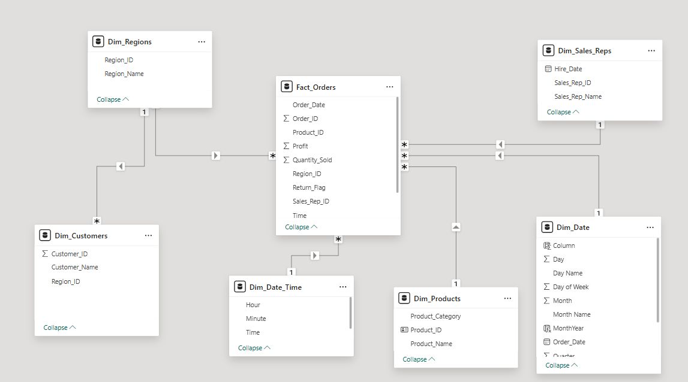
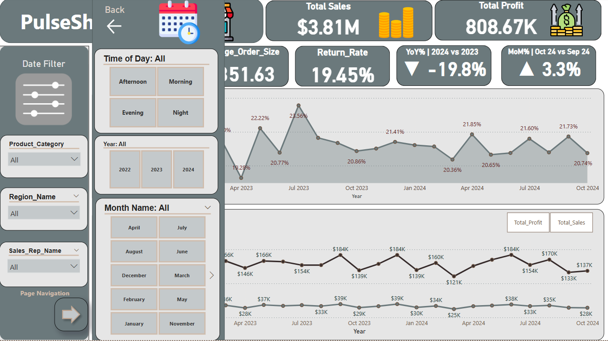
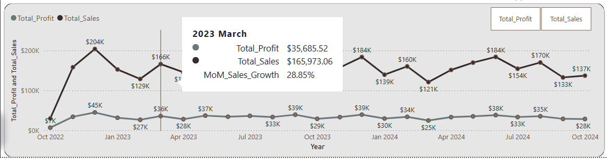
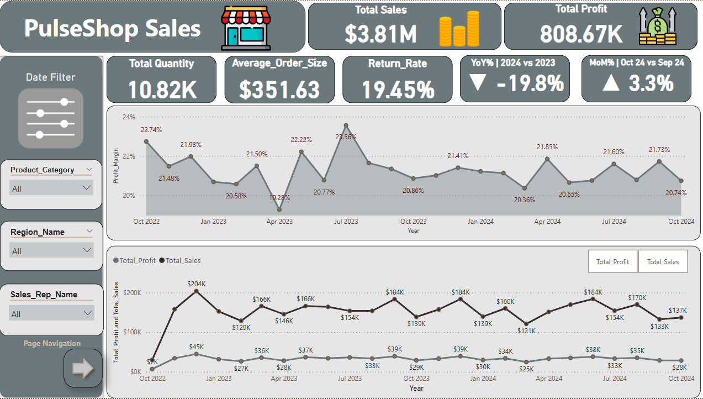
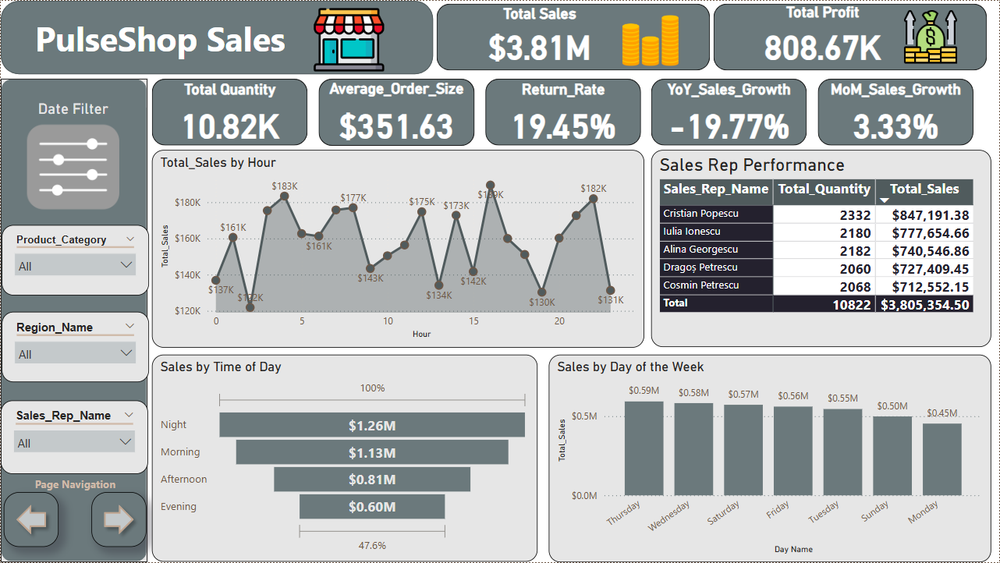
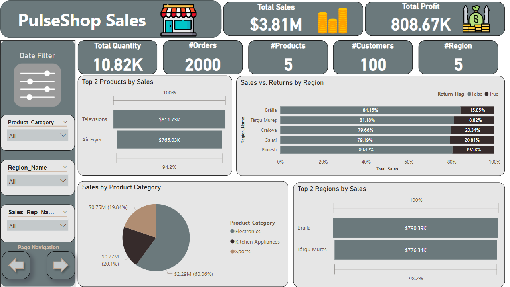
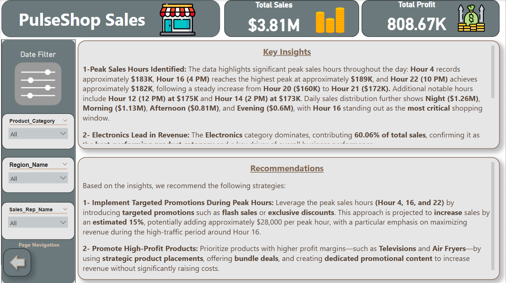

# PulseShop Sales Analysis Dashboard

## Overview
This Power BI dashboard provides an interactive analysis of PulseShop's sales data from October 2022 to October 2024. It delivers actionable insights into sales performance, product categories, regional trends, and sales representative contributions, enabling data-driven decision-making. 

The project includes data preparation, transformation, star schema modeling, DAX calculations, and four main dashboard pages: **Overview**, **Trends Analysis**, **Performance Details**, and **Insights & Recommendations**.

Key features include a dynamic date slicer with bookmark navigation and a flexible parameter for toggling between Sales and Profit visuals.

### Key Highlights
- **Total Sales**: $3.81M
- **Total Quantity Sold**: 10.82K
- **Total Profit**: $808,670
- **Average Order Size**: $35.15
- **MoM Sales Growth**: 87.14%
- **YoY Sales Growth**: -1.07%
- **Return Rate**: 19.45%

The dashboard is fully interactive with slicers for Date, Product Category, Region, Sales Rep, and Time of Day.

## Data Preparation & Modeling

- Imported and cleaned the raw data using **Power Query**.
- Split the data into one central **Fact_Orders** table and multiple **Dimension tables**.
- Built a clean **Star Schema** model optimized for performance and DAX calculations.

*Figure: Star Schema relationships between Fact_Orders and Dimension tables.*

## Key Features

### 1. Dynamic Date Slicer with Bookmark

The dashboard features an advanced **Date Slicer** supporting filtering by:
- Year, Month, and Day
- Time of Day (Morning, Afternoon, Evening, Night)

Users can quickly reset to the default view using the dedicated **Bookmark** (Back button with calendar icon).

### 2. Parameter for Sales & Profit Toggle

A dynamic parameter enables users to seamlessly switch between **Total Sales** and **Total Profit** views in the trend charts. This provides greater flexibility for different types of analysis.

## DAX Measures

Custom DAX measures were created to power dynamic calculations across the dashboard:

- **Total_Sales** = SUM(Fact_Orders[Total_Sales])
- **Total_Profit** = SUM(Fact_Orders[Profit])
- **#Orders** = COUNTROWS(Fact_Orders)
- **#Customers** = DISTINCTCOUNT(Customers[Customer_ID])
- **Average_Order_Size** = DIVIDE([Total_Sales], [Total_Quantity], 0)
- **Return_Rate** = DIVIDE(SUM(Fact_Orders[Returns_Sales]), [Total_Sales], 0)
- **MoM_Sales_Growth** = Month-over-month growth percentage
- **YoY_Sales_Growth** = Year-over-year growth percentage
- **Profit_Margin** = DIVIDE([Total_Profit], [Total_Sales], 0)

## Dashboard Structure

The dashboard consists of four pages:

### 1. Overview
High-level KPIs, cards, and trend charts for sales and profit with MoM comparison.

### 2. Trends Analysis
Time-based analysis including hourly sales, day of week performance, and top sales representatives.

### 3. Performance Details
Detailed breakdown by products, regions, categories, and customers with funnel and pie charts.

### 4. Insights & Recommendations
Key business insights and actionable recommendations to improve sales performance.

## Dashboard Screenshots

### 1. Overview Page

### 2. Trends Analysis Page

### 3. Performance Details Page

### 4. Insights & Recommendations Page

## Key Insights
- Peak sales occur at **Hour 16** ($189K), with **Night** period contributing the highest revenue ($1.26M).
- **Thursday** is the strongest day of the week ($0.59M).
- **Electronics** category dominates with **60.06%** of total revenue.
- Top performing products: Televisions and Air Fryer.
- Leading regions: Brăila and Târgu Mureș.
- Top sales representatives: Cristian Popescu, Iulia Ionescu, and Alina Georgescu.
## Documentation

### 1. User Guide
Detailed step-by-step instructions on how to open, navigate, and use the PulseShop Sales Analysis Dashboard, including how to use the Date Slicer, Parameter, and update the data.

**[Download User Guide (PDF)](User_Guide.pdf)**

### 2. Project Report
Comprehensive technical report covering:
- Executive Summary
- Data Preparation & Transformation
- Star Schema Modeling
- DAX Measures
- Dashboard Structure & Design
- Additional Features (Bookmark + Parameter)
- Insights & Recommendations

**[Download Full Project Report (PDF)](Report%20for%20PulseShop.pdf)**

---

## Attachments
- `PulseShop_Dashboard.pbix` → The main Power BI file
- `PulseShop sales.xlsx` → Source data file
- `User_Guide.pdf`
- `Report for PulseShop.pdf`
## How to Run
1. Install **Power BI Desktop** (Free).
2. Open the `.pbix` file.
3. Load or refresh the data from `PulseShop sales.xlsx`.
4. Use the slicers and bookmark to explore the interactive dashboard.

## Tech Stack
- **Tool**: Power BI Desktop
- **Data Source**: Excel (.xlsx)
- **Modeling**: Star Schema
- **Language**: DAX
- **Features**: Bookmarks, Field Parameters, Interactive Slicers

